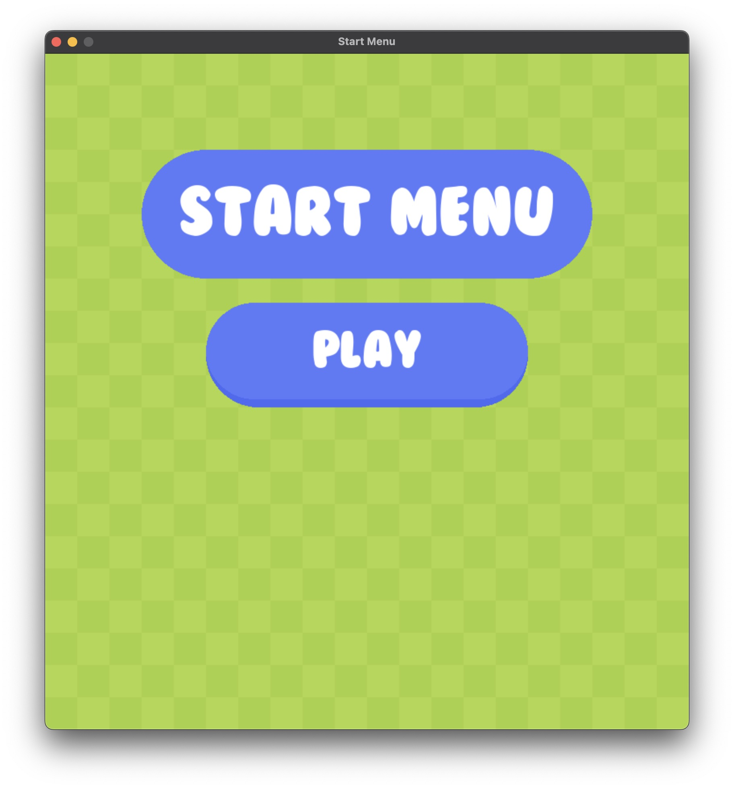
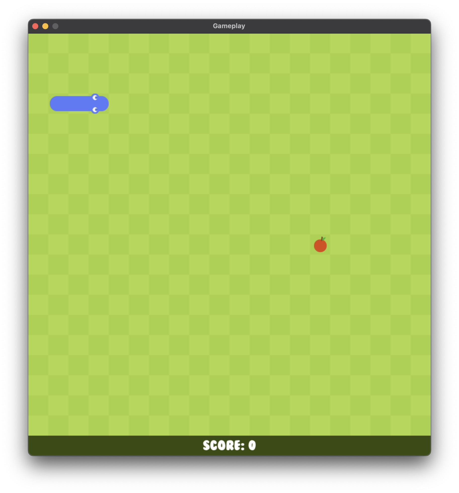
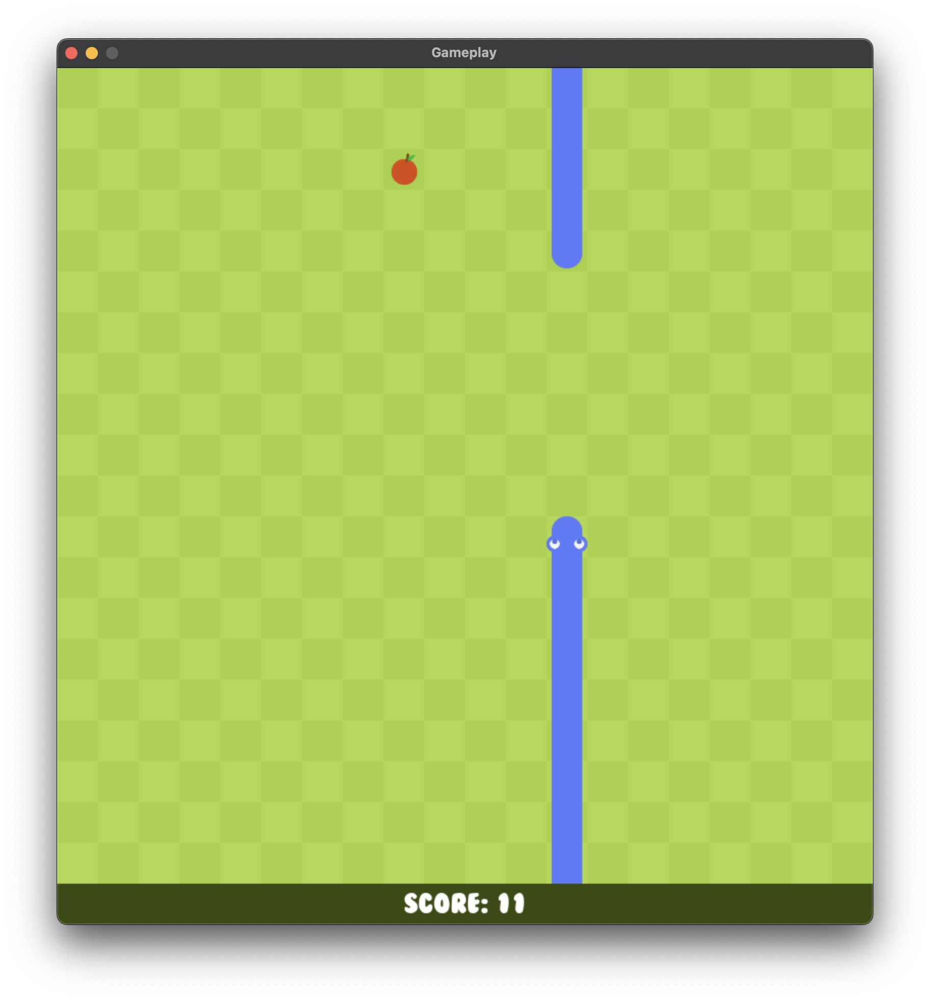

# SnakeGameInPython


Snake game in Python using the pygame module.\
Credits for the images and the sound: [here](https://github.com/clear-code-projects/Snake)

## Packages to Install

```zsh
pip install -r environment/requirements.txt
```

## Running the Game

Clone the repo. Then run the following commands:

```zsh
cd SnakeGameInPython
python code/main.py
```

or

```zsh
cd SnakeGameInPython/code
python main.py
```

## Screenshots

<p>
  
  
  
  
</p>

## Author

Berkay Kush
